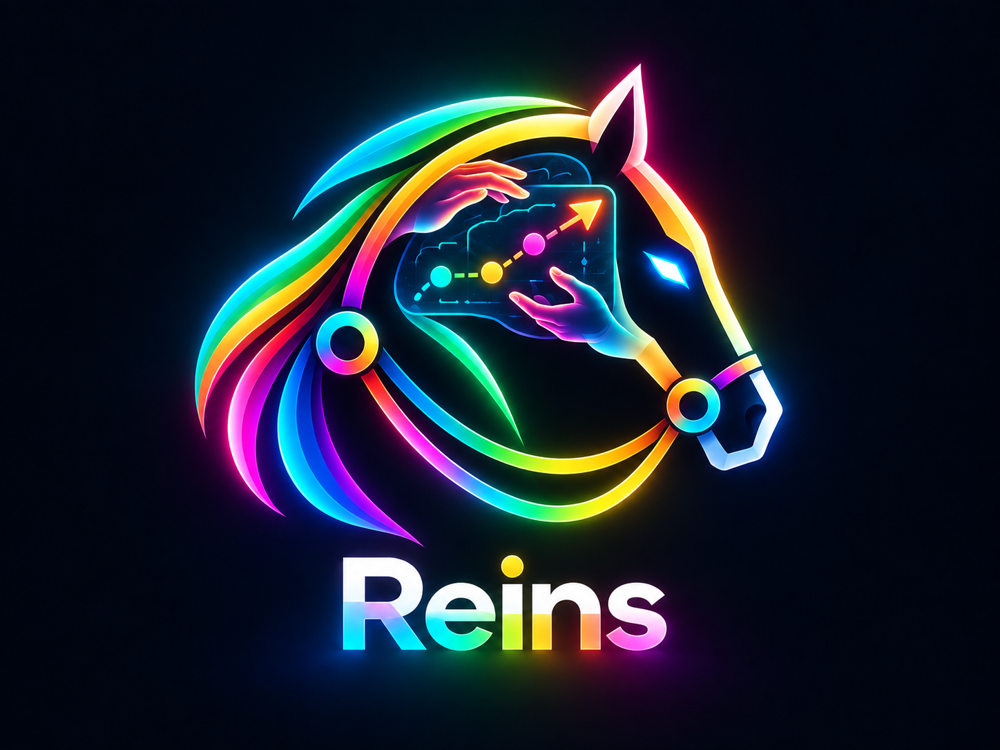

<p align="center"></p>

# Reins

**Any VLM. Your hands on the reins.**

A VLM-agnostic harness for robot control that surfaces the model's plan for human review before a single actuator fires. Swap in any vision-language model, and it gets smarter every time the models do.

## Intention

The novelty here is not the model. It is the harness around it.

Reins optimizes the harness for VLM-driven robot control. Making it model-agnostic means its value compounds passively: every improvement from Anthropic, OpenAI, or anyone else lands in Reins for free. We don't have to win the model race. We just have to be the best place to plug the winner in.

Where we add value is the interaction between the VLM and the human. Before the model instructs the robot, the harness surfaces what the model intends to do, and the human gets feedback on that intention first. Reviewing the plan before acting on it, rather than watching the robot and reacting after, is the core idea. That loop is what turns a capable model into a controllable one.

## Status

A first simulation-only preview is available in [`sim/`](sim/README.md). It loads Unitree R1, predicts a named-joint plan, and draws the planned hand path. A separate [Spectacles AR prototype](spectacles/README.md) displays mock or WebSocket-fed hand paths aligned with shoulder tracking cards on the R1. The AR prototype currently has its own demo trajectory feed; integrating it with the Reins contract remains to be done. Neither preview commands physical hardware.

## Observatory UI

Launch the modern local dashboard with:

```sh
.venv/bin/python tools/dashboard.py
```

Open **http://localhost:8090** for the MuJoCo trajectory preview, robot cameras,
a glasses video or mirrored-window view, and trajectory control (Dry run,
Execute behind a dry-run gate and confirmation, Abort). See the
[dashboard guide](tools/dashboard/README.md). The preview is local. Only the
control panel reaches the robot, through `tools/arm_lift.py`.

## Voice in simulation

The optional [voice lab](voice/README.md) adds speech-to-text to the existing
prompt box and Gemini/Cartesia text-to-speech for replies. Voice Focus, VAD and
Tyto 1.1 process microphone input. The team retains its existing LLM and harness.
Run the dashboard with `--sim --voice-url http://127.0.0.1:8770/` beside the
MuJoCo preview. The UI uses a neutral theme with the colourful Reins logo.
