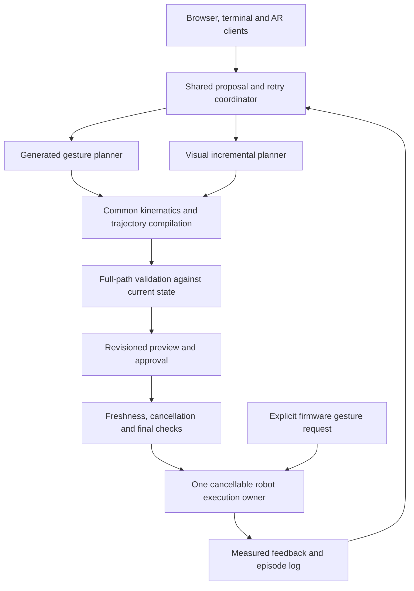

# Reins project and LLM-control review

Date: 2026-09-27  
Reviewed branch: `fix/dashboard-trajectory-retries`, based on commit `8b32789`, **including the existing uncommitted working tree**.

## Assessment

Reins has two useful LLM planning approaches and several competing implementations of the machinery around them. It is not one integrated harness yet.

The browser dashboard is strongest at compiling and checking a newly authored gesture for simulation. The `harness/` package is strongest at structuring a repeated camera → model → bounded action → feedback loop, and it has a hardware executor. However, that executor does not inherit the browser planner's stronger trajectory checks. The documented review/approval contract is not the protocol used by either runtime.

Keep both planning approaches. Consolidate their robot model, trajectory validation, proposal state, approval, cancellation, and execution services. New gestures should remain possible without adding a predefined skill for each gesture.

There are confirmed defects in live-control boundaries, automatic replanning, recovery, and exported plans. The live-control findings below should be addressed before treating this as a reliable integrated controller.

## Scope and evidence

I traced project-owned planning, provider, validation, preview, review, and execution code across `core/`, `harness/`, `tools/`, `sim/`, `contract/`, and `spectacles/`, including their tests and launchers. Camera, detection, recording, and AR adapters were inspected for their role in these paths. This was not a line-by-line audit of vendored SDK code, model weights, meshes, or third-party libraries.

No real robot commands, live model requests, or physical experiments were performed. Reproductions used the local MuJoCo model, mocked robot backends, fake DDS components, temporary files, and loopback sockets. A native model contact count is evidence about that model, not a measurement of physical collision.

Evidence is retained beside this report:
- [Offline probe source](offline_probes.py) and [results](offline_results.json).
- [Integration probe source](integration_probes.py) and [results](integration_results.json).

## Where the harness idea appears

| Area and main files | What it actually does | Hardware relationship | Recommendation |
|---|---|---|---|
| `tools/dashboard.py`, `tools/dashboard/app.js`, `core/dashboard_chat.py` | Browser chat, generated-motion proposals, one-shot simulation preview, firmware gesture controls | Authored plans are simulation-only; separate explicit gesture buttons can move the robot | Primary operator UI |
| `core/codex_chat.py`, `core/claude_chat.py`, API path in `core/dashboard_chat.py` | Model transport, structured replies, isolated CLI sessions and cancellation | No direct actuator commands | Reuse transport lifecycle code across planners |
| `tools/reins_mcp.py`, `core/reins_tools.py`, `core/tool_specs.py` | CLI tools for context, 2D detection, new hand paths, and preview | No execution tool | Adapter to a shared planning coordinator |
| `core/prompt_planner.py`, `core/generated_motion.py` | Compile authored Cartesian waypoints, built-in gestures, and older calibrated-object preview paths | Produces preview-only plans | Retain gesture compiler; make capability boundaries consistent |
| `core/ik.py`, `core/motion_validation.py` | IK, timed paths, joint/speed/acceleration checks, swept model and envelope checks | Currently used for preview, not the live harness | Starting point for common geometry/validation, with live-state extensions |
| `harness/loop.py`, `actions.py`, `interpreter.py`, `prompts.py` | Visual policy loop, subgoals, bounded incremental moves, feedback, recovery | Selects sim, dry-run, or live backend | Retain as a second planner strategy |
| `harness/vlm/*`, `perception.py` | Anthropic/OpenAI API, Claude CLI, file-inbox and scripted providers; camera packets | Supplies decisions and observations to the loop | Shared provider interfaces and explicit observation freshness |
| `harness/kinematics.py`, `safety.py`, `executor.py` | Separate IK, gate, interpolation, approval callback, execution and settling | Can send real arm trajectories | Replace duplicated rules with common validation and approval boundary |
| `harness/robot/arm_client.py`, `arm_stream.py`, `lowstate.py` | Local socket bridge, telemetry, 50 Hz DDS streaming and watchdogs | Actual hardware execution | Harden and make this the exclusive execution owner |
| `harness/feedback.py`, `demos.py`, `recorder.py`, `stats.py` | Operator notes, optional demonstrations, episode logs/exports, latency/token metrics | Context and records, not an alternative controller | Retain useful logging; fix exports and distinguish measured vs commanded data |
| `tools/reins_ui.py`, `start_all.sh` | Older Tk UI: harness launcher, proposal approval, teaching, replay, execution, TTS | Launches several hardware-capable paths | Migrate needed functions into one UI; retire duplicate orchestration |
| `tools/arm_lift.py`, `teach.py`, `record.py` | Legacy plan execution, hand teaching and passive recording | Independent DDS execution path in `arm_lift.py` | Route execution through the same owner and validator |
| `core/r1_gestures.py`, `tools/r1_gestures.py` | Discover and invoke firmware arm-action presets | Physical preset service, separate from generated trajectories | Keep as a distinct capability with shared ownership arbitration |
| `spectacles/plan_feed.py`, `review.py`, `Assets/R1Trajectory.js` | Show FK paths in AR and return proposal decisions | Can authorize a live harness proposal when review is enabled | Thin authenticated review client |
| `spectacles/trajectory_server.py`, `make_walk_plan.py`, `preview_walk.py`, `preview_static.py` | Mock paths, visualization, synthetic base-path composition | Does not implement robot walking | Mark as visualization/prototype utilities |
| `contract/reins.schema.json`, `contract/reins_contract.py` | Intended revisioned proposal/decision/execution protocol | Not wired into either runtime | Repair and adopt as an authoritative boundary, or replace with one runtime schema |
| `sim/preview.py`, `sim/plan_pick.py` | Plan loader/renderer and a separate hardcoded pickup/IK prototype | Simulation only | Keep preview; avoid promoting a third IK implementation |
| Camera, cockpit, twin, relay, stereo, detector and audio tools | Sensor transport, monitoring, visualization and operator utilities | Supporting infrastructure; not additional LLM policies | Clear service boundaries and one documented startup path |

### The two model strategies are different

**Generated gesture:** model authors a bounded sequence of hand positions → local IK and timing → full-path validation → preview. Current generated paths control one arm's hand position; they do not express fingers, full wrist orientation, walking, or contact. A “blow a kiss” can therefore only be an approximate arm gesture, with an approach that respects the head envelope.

**Visual incremental policy:** model sees camera images and state → chooses a bounded translation or wrist roll → local IK and gate → approval → execution → measured feedback → next decision. This can adapt to what happened, but uses a fixed vocabulary of small actions. Fixed action primitives do **not** mean it needs a predefined trajectory for every task. Demonstration recordings are optional context, not a required motion library.

The visual harness's simulation is a kinematic mock, and its DONE signal is a model judgment. These are useful for integration testing but do not establish physical task success.

## Prioritized findings

Priority P1 means a live-control or authorization boundary needs correction. P2 means a functional, integration, or future-boundary defect. Each finding distinguishes an executed reproduction from source inspection.

### 1. P1 — The live harness does not validate collisions throughout a trajectory

Sources: [harness/safety.py](../../../harness/safety.py) (`vet`, `check_trajectory`), [harness/executor.py](../../../harness/executor.py) (`go_to_joints`), [harness/kinematics.py](../../../harness/kinematics.py) (`_pose`).

The gate compares native contact counts at the target against a baseline. The trajectory recheck covers joint limits and velocity, not contacts throughout the move. The kinematics model resets other joints and applies only the selected arm and waist; it ignores the actual opposite-arm pose supplied in the state.

**Reproduced:** a joint move had 8 contacts at each endpoint and 12 at an intermediate pose. The trajectory check passed and the mock executor streamed 341 frames. Separately, an input left-shoulder angle of -1 rad remained 0 in the collision model while planning the right arm. The endpoints were baseline-contact poses, not contact-free poses.

**Consequence:** a move may pass the gate despite an intermediate collision or collision with the actual opposite arm. Contact counts also do not identify which contact pairs changed.

**Change:** validate the exact interpolated trajectory using the full measured joint configuration and relevant geometry. Use contact identities/clearance rules rather than only a count. Bring the stronger preview validator into the common pipeline after adapting it for live state and supported joints.

### 2. P1 — Client disconnect and stop requests cannot reliably interrupt an active stream

Sources: [harness/robot/arm_stream.py](../../../harness/robot/arm_stream.py), especially lines 133, 174, 220–244; [harness/robot/arm_client.py](../../../harness/robot/arm_client.py), lines 42–48 and 74–75.

The server processes an entire frames command synchronously and disables the client-heartbeat watchdog while serving it. The client also holds one lock while awaiting the command response, preventing its heartbeat or freeze call from using the connection during that wait.

**Reproduced with fake DDS:** after closing the client during a stream, a 0.2-second watchdog had still not released at 0.65 seconds. Streaming remained active and 32 additional publishes occurred. The server only gets to discover the disconnected socket after finishing the command.

Other telemetry/tracking watchdogs exist; this finding is specifically about client liveness and preemption.

**Change:** keep socket receive, liveness monitoring, and cancellable motion execution independent. Give stop/release a path that cannot queue behind the trajectory it must interrupt, and test this during long commands.

### 3. P1 — Approval does not trigger a final state/e-stop check

Sources: [harness/executor.py](../../../harness/executor.py), lines 110–120 and 201–209; [harness/robot/arm_stream.py](../../../harness/robot/arm_stream.py), lines 162–168.

Motion is checked before the potentially long human approval callback. After approval, the executor streams without rechecking e-stop or obtaining a fresh starting-state validation. The streamer can additionally prepend lead-in frames to approach the first target; these are generated after review and have only its velocity check.

**Reproduced:** setting the gate's e-stop during the confirmation callback and then returning approval still produced a successful mock result and sent 20 frames. The added lead-in and absence of post-review state validation were established by source inspection.

**Change:** bind approval to the final resolved trajectory and its starting-state assumptions. Immediately before execution, recheck cancellation, state freshness and tolerances. Any additional approach segment must be validated and covered by the proposal; materially changed motion needs a new revision.

### 4. P1 — The AR approval channel does not authenticate the approving client

Sources: [spectacles/plan_feed.py](../../../spectacles/plan_feed.py), lines 337–362 and 381–390; [spectacles/review.py](../../../spectacles/review.py).

With `--review-file` enabled, the WebSocket publishes the pending review ID to clients and accepts a decision bearing that ID. The default listener is `0.0.0.0`. Proposal IDs and file hashes correctly help reject stale/mismatched decisions, but they do not identify an authorized operator.

**Reproduced on loopback:** a plain client supplied no credential, read a pending proposal marked `live`, sent approve, received an accepted acknowledgment, and caused the mailbox consumed by the harness to yield approve. No robot was connected.

**Consequence:** any client able to reach this review-enabled endpoint can authorize a proposal.

**Change:** pair/authenticate the approving device, authorize review messages separately from viewing, and bind each decision to a session and exact revision. Keep the existing freshness/hash protections.

### 5. P2 — Automatic trajectory revision depends on the entry point

Sources: [core/reins_tools.py](../../../core/reins_tools.py), lines 112–122; [core/prompt_planner.py](../../../core/prompt_planner.py), around line 246; [tools/dashboard.py](../../../tools/dashboard.py), lines 459–464.

The Generate preview button supplies the revision callback and can make up to three attempts. MCP `plan_hand_path` calls the same planner without that callback, so it makes one attempt. The tool marks rejection as retryable and instructions ask the model to revise, but the host does not guarantee another attempt.

**Reproduced:** an unreachable draft submitted through `ReinsTools.plan_hand_path` returned blocked, retryable=true, attempt=1, max_attempts=1.

This is a concrete explanation for a generated motion failing instead of being recalculated. It is not evidence that every failed gesture is feasible: some requests also exceed reach or available degrees of freedom.

**Change:** put bounded retry/revision policy in a shared coordinator used by both tool calls and UI submissions. Return structured failure stage, waypoint, geometry and constraint information; never solve a rejection by relaxing the constraints.

### 6. P2 — Recovery logic loses semantic failures

Sources: [harness/actions.py](../../../harness/actions.py), lines 53–56; [harness/loop.py](../../../harness/loop.py), lines 107, 137–138, 143–158 and 186–187.

**Reproduced:** a forward/backward action pair does not trigger the intended oscillation check. `opposite_of` constructs an Action with empty `raw`, while `same_token` requires a nonempty `raw`.

**Source-confirmed additional gap:** queuing the rest of a model-proposed chunk checks several specific failure flags but does not require `result.ok`. A collision rejection can therefore leave later chunk actions queued instead of forcing a revised decision. The next-prompt feedback also handles IK/clamping/stalling specifically rather than systematically including every failure.

**Change:** compare normalized action semantics, not raw spelling. Drop chunks on any unsuccessful execution; feed a structured rejection back to the planner and cap recovery attempts.

### 7. P2 — Multi-move recordings can be invalid for the simulation loader

Sources: [harness/recorder.py](../../../harness/recorder.py), lines 92–100; [sim/preview.py](../../../sim/preview.py), around line 36; [harness/tests/test_export.py](../../../harness/tests/test_export.py).

Each move includes its first sample at the current time, which duplicates the timestamp of the previous move's final hold sample.

**Reproduced:** exporting two accepted moves produced duplicate time 0.9. The real simulation loader rejected it with “Keyframes must start at 0 and have increasing times.” The export test's nondecreasing/sorted check does not catch this.

**Change:** emit each boundary timestamp once and validate the generated artifact through the actual consumer. Label commanded and measured paths distinctly, especially for dry-run exports.

### 8. P2 — The intended contract neither governs runtime execution nor proves approval

Sources: [contract/reins_contract.py](../../../contract/reins_contract.py), lines 75–106; runtime entry points listed above.

Repository references show no use of the contract validator/protocol in either live runtime. Within the contract's own session validator, execution checks that a plan was proposed as-is and that state says executing, but does not require an approving decision for that plan revision.

**Reproduced:** removing the final applicable approval from `contract/examples/session_reach.jsonl` still passes `check_session`.

This is a defect in the intended validation boundary, not evidence that this unused module currently authorizes the live robot.

**Change:** track the actual approval and invalidate it on revision, rejection, expiry or cancellation. Then make one proposal/execution schema authoritative instead of maintaining a contract alongside unrelated runtime protocols.

### 9. P2 — Numeric and metadata boundaries need tightening

**Action parser:** [harness/actions.py](../../../harness/actions.py), line 121. The numeric parser accepts nonfinite floats. Reproduced `MOVE forward nan` retaining NaN and `MOVE forward inf` becoming a capped 0.2 m motion. Later layers have additional checks; this does not demonstrate NaN reaching hardware. Reject nonfinite values immediately and send a structured model error.

**Preview metadata:** [spectacles/make_walk_plan.py](../../../spectacles/make_walk_plan.py), `combine`, reconstructs a plan without preserving `preview_only`. Reproduced true → absent. [tools/arm_lift.py](../../../tools/arm_lift.py) relies on that marker to reject generated preview plans. This is a conversion hole if someone subsequently feeds the resulting file to the legacy executor, not an automatic dashboard-to-hardware path. Preserve execution restrictions through every transform and enforce provenance at the executor.

## Architectural issues beyond the individual bugs

### Different definitions of a valid motion

There are three IK implementations: `core/ik.py`, `harness/kinematics.py`, and the pickup prototype in `sim/plan_pick.py`. There are also separate timing and execution rules. The browser validator caps joint velocity at 0.4 rad/s, the harness at its configured 0.8 rad/s, and the legacy arm tool uses 1.5 rad/s. Different operating profiles can be justified, but these profiles currently belong to separate implementations rather than an explicit shared policy.

The legacy executor rebuilds the beginning/return of plans and reports model contacts as warnings rather than using the browser validator's veto. The streamer does not independently enforce the full planner contract. Reviewing a picture or a JSON file therefore does not consistently identify the exact final trajectory checked and sent.

### Multiple processes can own the robot

The harness streamer, legacy arm executor and firmware gesture service are independent command paths. UI “busy” state is local to a frontend; there is no shared robot ownership lease across these paths. Source inspection establishes this architectural gap; concurrent hardware control was not tested.

A single owner should arbitrate which capability may command the robot, reject conflicting commands, and expose one state/stop interface. Firmware gestures can stay a separate capability without staying an independent ownership model.

### The observation is a historical snapshot

Harness camera frames arrive sequentially over HTTP, and packet receipt time does not establish synchronized sensor capture time. Model inference and human review can take substantial time. There is no comprehensive fresh-scene check immediately before execution. The core calibrated-observation path has more explicit timestamps, but it is not wired into the live loop.

This needs explicit observation/state age and assumptions in the proposal, plus revalidation before execution. It does not require promising unsupported metric object localization: current browser tools deliberately expose 2D boxes only.

### Provider and session infrastructure is duplicated

Dashboard CLI transports have explicit process-group cancellation, bounded output, and isolated configuration. The harness Claude adapter uses blocking `subprocess.run` with a timeout and separately managed image files. Both need the same basic process lifecycle and cancellation semantics, even though their payloads differ.

The file-inbox provider also uses a shared directory and clears existing request subdirectories when initialized. Concurrent sessions need separate identifiers/directories. Operator feedback can inform future prompts, but remembered text is not a replacement for geometric validation.

### The UI and documentation describe different products

The simplified browser dashboard has one-shot previews and preset buttons, while the older Tk application still contains replay, recording, teaching and another execution workflow. Removing those controls from the browser did not remove them from the project.

The root status section omits the newer hardware harness. `core/README.md` still leads with calibrated RGB/depth object approaches, while current MCP tools explicitly disallow metric object reaching and expose only 2D detection. Legacy startup comments and platform-specific commands add confusion.

Document one current capability matrix: generated gesture, visual incremental action, firmware preset, object detection, object reach, gripper, simulation and hardware. Generate model-facing capability descriptions from that same source.

## Recommended shape



This preserves the useful distinction between a complete gesture and a camera-guided step. It removes duplicated enforcement around them.

### Practical order

1. **Repair live boundaries:** swept/full-pose validation, preemptive stop/disconnect handling, post-approval checks, authenticated AR review, and exclusive robot ownership. Add focused fault-injection tests for each reproduced case.
2. **Make proposals authoritative:** one resolved trajectory representation, revision/digest, start-state assumptions, validation report, expiry, approval and execution status. Preserve restrictions through transformations; include any approach segment.
3. **Unify planning failure handling:** structured errors and host-owned retry budgets shared by MCP, button submissions, and visual-loop recovery. Fix oscillation, chunk invalidation, numeric parsing and export timestamps.
4. **Consolidate implementations:** reuse the strongest suitable geometry and transport code; extend it for the harness's wrist roll and measured full pose. Adapt and verify the core validator rather than simply connecting a preview-only component to hardware.
5. **Simplify the product:** one main dashboard, thin terminal/AR adapters, explicit modes and capabilities. Retire duplicate execution launchers after migration. Keep low-level diagnostic tools clearly separated.
6. **Measure task quality:** deterministic scenarios for successful novel gestures, unreachable paths, recoverable rejection, stale observations, model timeouts and denied approval. Track task outcome and geometric/operational failures, not only latency, tokens or model-declared DONE.

## Validation performed

The combined local test command was:

```sh
PYTHONPATH=/tmp/reins-review-deps:$PWD .venv/bin/python -m pytest -q \
  harness/tests contract/tests spectacles/tests core \
  tools/test_dashboard.py tools/test_dashboard_http.py
```

Result: **236 passed, 1 failed, 3 errors; 21 subtests passed.**

- Initial collection required PyYAML, missing from this venv. PyYAML 6.0.3 was installed into `/tmp/reins-review-deps` only; application dependencies were not modified. The harness README mentions PyYAML, but there is no unified project dependency manifest.
- The failure was `test_cli_proposal_protocol`: its subprocess environment hardcodes `MUJOCO_GL=cgl`, which is invalid on this Linux host.
- Three streamer-watchdog fixtures errored because the installed SDK lacked `utils/lib/crc_amd64.so`. They mock other DDS components but still instantiate the SDK CRC loader.
- Separate review probes mocked CRC as well as publisher/telemetry, allowing the disconnect logic to be evaluated without hardware.
- Existing tests were not edited to conceal these failures. The suite is not reported as fully passing.

To repeat the saved probes from the repository root in this review environment:

```sh
PYTHONPATH=/tmp/reins-review-deps:$PWD .venv/bin/python docs/reviews/2026-09-27/offline_probes.py
PYTHONPATH=/tmp/reins-review-deps:$PWD .venv/bin/python docs/reviews/2026-09-27/integration_probes.py
```

These are diagnostic reproductions, not regression tests or hardware qualification. Their result files are written under `/tmp`; the JSON files beside this report preserve the review's observed output. The timing-dependent publish count may vary.

No application source was changed as part of this evaluation. The existing working tree was preserved; only this report and its evidence were added.
