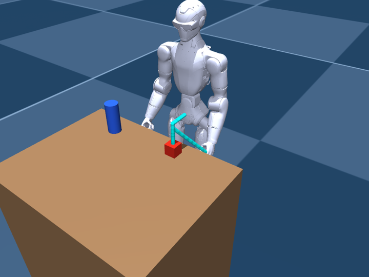

# Harness: an LLM drives the R1 in sim

Give a model a task ("put the red cube on the counter"). It walks the R1
around the room, picks things up and puts them down, through tools. Every
motion it asks for becomes a plan that a human reviews first, in words in the
terminal and drawn in the scene. Nothing moves until the human approves.
Declining with feedback sends that feedback back to the model.

```
task ─► brain (Claude, or any model) ─► tool call ─► Skills ─┬─ robot_state / look / locate: answer at once
            ▲                                                └─ anything that moves: a contract plan
            │                                                        │  preview (terminal, viewer, PNG)
            │                                                    reviewer ── n / feedback ──┐
            │                                                        │ y                    │
            │                                               execute in sim (Enter stops)    │
            └───────────────────── tool result ◄─────────────────────┴──────────────────────┘
```

Simulation only. Nothing here opens the Unitree SDK.

## Run it

Needs `mujoco numpy scipy pillow jsonschema`, plus `claude-agent-sdk` and the
`claude` CLI for the default brain, or `anthropic` for `--brain api` (and
`pytest` for tests). From the repository root:

```bash
mjpython harness/run.py "Put the red cube on the counter"            # Claude via Claude Code, live viewer
python3 harness/run.py --headless "Bring the blue bottle to the counter"
python3 harness/run.py --brain demo --headless --auto-approve --gif harness/demo.gif
python3 -m pytest harness/tests
```

- **Default brain: Claude through Claude Code.** It uses the Claude Agent
  SDK to run your local `claude` CLI on its own login, so no API key is needed.
  Log the CLI in once with `claude auth login`. The model gets only the robot
  tools: Claude Code's built-in tools are off, and your Claude Code settings
  and CLAUDE.md files aren't loaded. When started from inside a Claude Code
  session, the harness drops that session's environment variables so the CLI
  uses its own login. `--model` and `--effort` pass through.
- **`--brain api`** calls the Anthropic API directly and needs
  `ANTHROPIC_API_KEY`. It defaults to `claude-opus-5` with adaptive thinking,
  and the server-side refusal fallback is on: if a safety classifier declines
  a turn, the API reruns it on a fallback model.
- **`--brain demo`** does the cube-to-counter task with no model at all,
  through the same tools a model gets. It cheats only at choosing which pixel
  to point at, using the sim's truth; that's the vision model's job. Use it to
  try the review loop without a login, and as an end-to-end test of the
  perception chain.
- **`--no-drift`** gives the robot perfect odometry. By default it drifts, like
  dead reckoning on the real robot.
- **Reviewing:** type `y` to run a plan, `n` to decline it, or any other text
  to decline it with that text as feedback for the model. While the robot moves,
  press Enter to stop it. Closing the viewer also stops it.
- Each run writes `harness/sessions/<time>/`: a PNG preview of every plan, and
  `session.jsonl`, the whole session as contract messages.



*A `pick_up` plan waiting for review: the cyan line is the left hand's path
up over the cube, down onto it and back up with it.*

## What the model knows: only what the real robot can sense

The model has no ground truth. It isn't told what's in the room, where anything
is, or whether a grasp worked. It gets what the real R1 could give it:

- **Proprioception** (`robot_state`): joint angles, hand positions computed from
  them, IMU, whether each hand is closed, and odometry. Odometry is dead
  reckoning from where the robot started, and by default it drifts (3% on
  distance, 3% on turning) because the R1 SDK has no odometry of its own.
- **The head camera** (`look`, and a fresh frame after every executed plan).
  It's modelled on the published R1 Basic/EDU specs: a binocular depth camera,
  up to 150° horizontal × 124° vertical, 1280×1088 RGB, 544×448 depth. The
  field of view is too wide for a pinhole lens, so the sim renders a wide
  pinhole frame and remaps it to an equidistant fisheye. The model gets the
  RGB at 960×816, with pixel ticks on the edges so it can name pixels. Depth
  has stereo-like noise that grows with the square of the range.
- **Depth, by pointing** (`locate`): the model points at pixels, and the
  harness turns them into 3D positions from the depth image. This is how it
  finds objects and spots to put things.
- **An obstacle map** built only from depth images, used for path planning.
  Nothing it hasn't seen is avoided. Walking into something unseen is caught
  as a bump, the way the real robot would hit it.

| tool | what it does | moves? |
|---|---|---|
| `robot_state` | joints, IMU, odometry, hand positions, grip state | no |
| `look` | head camera image | no |
| `locate` | pixels in the last image → 3D points (robot and odom frames) | no |
| `walk_to` | walk to a point, planning around obstacles seen so far | plan |
| `walk`, `turn` | short relative moves; turning is also how it looks around | plan |
| `approach` | walk to where a hand can reach a point, facing it | plan |
| `pick_up` | at a point from `locate`: hand above, down, close, lift | plan |
| `place` | at a surface point: hand above, down to just above it, open, lift | plan |
| `reach` | move a hand to a point and hold it (pointing, gestures) | plan |
| `arm_home` | relax the arms | plan |

The camera sees an object's top and near side, not its middle. So `pick_up`
reaches 2 cm past the pointed-at spot, and down to halfway between that spot
and the surface around it, which it estimates from the same depth image.

Only the simulator and the human's drawings use the sim's truth. The simulator
uses it to decide whether a grasp caught something and where a released object
lands. The drawings map plans through the current odometry error, so they show
where the robot would really go. Tool results report only what the robot
knows ("right_hand closed"), and the model checks outcomes in the camera image.

A tool that can't be planned returns an error saying why, for example "can't
pick up at that point from here (0.52 m away; approach it first)". After a
decline or a failure, the remaining calls from the same model turn are
skipped, so a plan queued behind a rejected one never runs.

**Unverified, and worth measuring on the robot:** the camera's position and
downward tilt in the head (`world.HEAD_CAMERA_POS`, `HEAD_CAMERA_PITCH`, set to
20°), its true lens model and calibration, whether its depth is range or
z-depth, and the real depth noise. `tools/camstream.py` on `origin/main`
already streams the head cameras from the Jetson.

## Pieces

- **`world.py`: `SimWorld`.** `reins_loco.sim.SimLoco` for the base, plus arm
  joints, graspable objects, hand sites and a head camera, split into what the
  sim knows and what the robot senses (odometry, proprioception, captures,
  the obstacle map). The sites and camera are added to the R1 model with
  `MjSpec` at load time.
- **`camera.py`**: the fisheye model (pixel ⇄ ray, the part that carries over
  to the real camera) and the MuJoCo emulation (image, depth with noise, and a
  mask of the robot's own body, which the real robot gets from its joint
  angles).
- **`demo.py`**: the pointing demo brain. The scene is
  `sim/models/r1/scene_harness.xml`: a table with a cube and a bottle, a
  counter, and a plant. `obstacle_*` geoms are solid, box tops are surfaces
  you can place on, and `object_*` bodies can be picked up.
- **`skills.py`: the tools.** Turns each call into contract steps (`walk`,
  `arm`, `grip`) plus an overlay to draw, and runs approved steps.
- **`ik.py`**: least-squares position IK for one arm (shoulder ×3 + elbow),
  the approach of `sim/plan_pick.py`, solved from where odometry says the
  robot stands. From a relaxed arm it reaches about 0.38 m in front of the
  pelvis at table height, so `approach` stands 0.33–0.38 m from the target.
  It follows Cartesian lines in 4 cm pieces and times them so no joint exceeds
  0.8 rad/s.
- **`planner.py`**: A* on a 5 cm grid over the depth-built obstacle map, shortcut to
  straight segments with 12 cm of margin, so the path follower's corner-cutting
  stays clear.
- **`brains.py`**: the `Brain` interface (start, then step with tool results).
  It has a `ClaudeCodeBrain`, an `AnthropicBrain` and a `ScriptedBrain` (tests). Each brain keeps its own
  conversation in its own provider's format. Adding OpenAI, Gemini or a local
  VLM is one class.
- **`agent.py`**: the loop, the reviewers (`TerminalReviewer`,
  `AutoApprove`), and `SessionLog`, which validates every message against
  `contract/reins.schema.json` as it writes it.
- **`display.py`**: offscreen previews and GIF, or the live viewer, drawing
  the same overlay. Orange is the walking path, with a translucent ghost of the
  robot where it will stop. Cyan and orange lines are the left and right hand
  paths, yellow marks targets, and blue is where the robot actually walked.

## Contract

Plans are contract v0.1 `plan` objects, and a session is a legal sequence of
`command`, `state`, `plan_proposed`, `decision`, `execute` and `done`
messages. `check_session` accepts every log the harness writes, and the
tests check that. Picking up needed one addition: a provisional `grip` step
(`contract/README.md`). Walking uses the provisional `walk` step, as `loco/`
does.

## What this is not

- **Not physics.** Like `SimLoco`, everything is kinematic. The base follows
  velocity commands, the arms follow joint targets exactly, and a grasp
  attaches the object if the hand site is within 3 cm of its centre. Nothing
  tests balance, contact, grip or whether the forearm clips the table. A
  released object drops straight down onto the surface below it.
- **Not a validated camera.** Clean renders with added noise are kinder than
  a real camera: no motion blur, glare, transparent objects or calibration
  error. The robot's footprint is a 0.20 m circle, not its real shape.
- **Grasp by proximity.** A released object drops straight down, and a grasp
  holds if the hand closes within 3 cm of the object's middle.
- **One arm variant, approximately.** IK uses the MuJoCo model's arm
  (29-actuator R1), not the A5 hardware joint map. The hand site is a point
  13 cm past the wrist roll link.
- **Not wired to hardware.** The plans are contract plans, so the streamer and
  `UnitreeLoco` could run them later. That needs the grip step to mean
  something on real hands, and the checks listed in `loco/README.md`.
