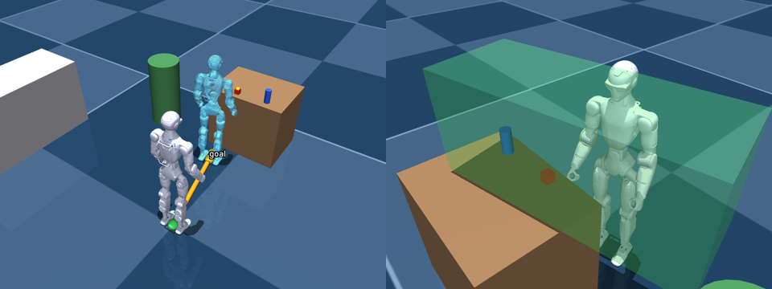

# harness/room: walk there, then hand the arm to the policy

The rest of `harness` is a closed-loop arm policy: a vision model moves one hand
in small steps from the head and wrist cameras. This layer sits on top. A
top-level model walks the R1 around a simulated room, finds things with the head
camera, walks up to them, and then calls `manipulate`, which hands one arm to
that policy for a bounded task. A human reviews every plan before anything
moves, and the whole session is logged as contract messages.

```
task ─► top-level brain ─► tool call ─► Skills ─┬─ robot_state / look / locate: answer at once
            ▲                                   └─ anything that moves: a contract plan
            │                                           │ preview (terminal, viewer, PNG)
            │                                       reviewer ── n / feedback ──────────┐
            │                                           │ y                            │
            │                     walk / arm step: executed in the room sim            │
            │                     servo step: harness.loop.Episode on RoomArmBackend   │
            │                                 (SafetyGate vets every move)             │
            └────────────────── tool result + fresh camera image ◄─────────────────────┘
```

Simulation only. Nothing here opens the Unitree SDK.



*What the reviewer sees. Left, a walk plan: the path, and a ghost where the
robot will stop. Right, a `manipulate` plan: the green box is where the arm
policy may move the hand. There's no fixed path to show, because the policy
decides each move from what it sees.*

## Run it

Needs `mujoco numpy scipy pillow pyyaml jsonschema opencv-python`, plus
`claude-agent-sdk` and the `claude` CLI for the default brain (`anthropic` for
`--brain api`). From the repository root:

```bash
mjpython -m harness.room "Put the red cube on the counter"        # live viewer
python -m harness.room --headless "Bring the blue bottle to the counter"
python -m harness.room --brain demo --headless --auto-approve --gif runs/room.gif
python -m pytest harness/tests/test_room.py
```

- **Two models.** The *top-level brain* walks, looks and decides. By default
  that's Claude through the local Claude Code CLI on its own login (`claude
  auth login` once). `--brain api` uses the Anthropic API instead. The *arm
  policy* is `harness/config.yaml`'s `vlm.provider`, set to `claude-cli` here.
  `--arm-vlm` picks another. Both get only the robot tools: Claude Code's
  built-in tools are off.
- **`--brain demo`** runs the whole task with no model: both stand-ins in
  `demo.py` cheat only at seeing (they read the sim's truth where a model reads
  the image), and drive the real code path otherwise.
- **Reviewing:** `y` runs a plan, `n` declines it, any other text declines it
  with that feedback for the model. Enter stops the robot mid-motion.
  `--review-moves` also asks before every arm move inside a `manipulate`, as
  `python -m harness live` does on the robot.
- `--set key=value` overrides `harness/config.yaml`, e.g. `--set
  steps.profile=coarse_fine` for 2–4 cm arm steps instead of 1 cm.
- Runs go to `runs/`: `room_<time>/` holds the plan previews and
  `session.jsonl` (contract messages). Each `manipulate` also writes the arm
  policy's own run folder (`runs/room_<time>_<task>/`), which
  `python -m harness replay` can re-query.

## What the models know: only what the real robot can sense

- **Proprioception** (`robot_state`): joint angles, hand positions from them,
  IMU, whether each hand is closed, and odometry. Odometry is dead reckoning
  from the start, and by default it drifts (3%) because the R1 SDK has none.
- **The head camera** (`look`, and a fresh frame after every executed plan).
  It's modelled on the published R1 Basic/EDU specs: up to 150° × 124°, emulated
  as an equidistant fisheye with pixel ticks for pointing, plus a depth image
  (544×448, noise growing with range²).
- **Depth, by pointing** (`locate`): pixels in, 3D points out.
- **An obstacle map** built only from depth. Unseen furniture isn't avoided;
  walking into it is caught as a bump.
- **The arm policy** sees the same head camera plus a rendered wrist camera, and
  gets Artur's usual text state (hand height above the surface, last-move
  feedback).

**Not verified on the robot.** The team reads the head camera as an RGB JPEG
through Unitree's video service (CLAUDE.md). A depth stream from it hasn't
been reached yet. So `locate`, and the depth-built obstacle map, rely on a
feature the spec promises but nobody has touched. The arm policy doesn't need
depth. Also unmeasured: the camera's mounting and tilt in the head
(`world.HEAD_CAMERA_POS`, `HEAD_CAMERA_PITCH`), and its lens model.

## Tools

| tool | what it does | moves? |
|---|---|---|
| `robot_state` | joints, IMU, odometry, hand positions, grip state | no |
| `look` | head camera image | no |
| `locate` | pixels in the last image → 3D points (robot and odom frames) | no |
| `walk_to` | walk to a point, planning around obstacles seen so far | `walk` step |
| `walk`, `turn` | short relative moves; turning is also how it looks around | `walk` step |
| `approach` | walk to where a hand can work at a point, facing it | `walk` steps |
| `manipulate` | hand one arm to the arm policy for a task, inside a safety box | `servo` step |
| `arm_home` | relax the arms | `arm` step |

`manipulate` proposes a contract `servo` step (provisional, `contract/README.md`).
What's approved is the task and its bounds, not a path: the workspace box from
`config.yaml` with its floor 2 cm above the `surface_z` the model read with
`locate`, the per-move cap, the joint speed cap and the step budget. The episode
then runs `harness.loop.Episode` unchanged. That includes its planner, its
controller prompts, `SafetyGate.vet` on every move (the only producer of joint
targets), `ArmExecutor`, and its recovery rules. `RoomArmBackend` is just
another `Backend`, next to `MockBackend`, `DryRunBackend` and
`ArmClientBackend`.

## Pieces

- **`world.py`: `SimWorld`.** The free-standing R1 in
  `sim/models/r1/scene_harness.xml` (a table with a cube and a bottle, a counter,
  a plant), on `loco/`'s `SimLoco`. Split into the sim's truth, which only the
  simulator, previews and tests read, and the robot's senses.
- **`camera.py`**: the fisheye model (pixel ⇄ ray, the part that carries over to
  a calibrated real camera) and its MuJoCo emulation.
- **`arm.py`**: `RoomArmBackend` and `RoomCameras`, Artur's backend and camera
  interfaces over the room, and `run_episode`.
- **`skills.py`**: the tools, their contract steps, and execution.
- **`planner.py`**: A* over the depth-built obstacle map.
- **`agent.py`**: the loop, the reviewers, and `SessionLog`, which validates every
  message against `contract/reins.schema.json`.
- **`brains.py`**: the top-level `Brain` interface, with `ClaudeCodeBrain`,
  `AnthropicBrain` and `ScriptedBrain`. Each keeps its own conversation format,
  so adding a provider is one class.
- **`display.py`**: previews, GIF and the live viewer, all drawing one overlay.
  Plans are drawn through the current odometry error, so they show where the
  robot would really go.
- **`demo.py`**: the stand-ins for both models.

## What this is not

- **Not physics.** The base follows velocity commands and the arms follow the
  streamed frames exactly. A grasp holds if the hand closes within 3 cm of the
  object's middle, and the sim's "EMPTY grasp" feedback stands in for a fitted
  gripper's closure sensor. The real R1 here has no hand (`hand.type: none` in
  `config.yaml`), so on the robot, manipulation means reach, touch and push.
- **Two frames, 3 mm apart.** The arm policy's kinematics use the fixed-base
  model (pelvis at 0.740 m). The room robot stands at 0.743 m.
- **No hardware path for walking yet.** `loco/`'s `UnitreeLoco` exists but has
  no odometry and no obstacle sensing (`loco/README.md`), and CLAUDE.md's
  control decision uses the loco client only as a safety wrapper. Walking steps
  are provisional in the contract.
