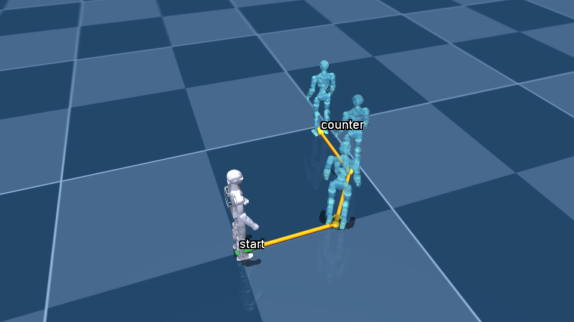

# Reins sim

MuJoCo scene for the Unitree R1, used to show a human the trajectory the robot is
about to take before anything moves.

A plan is a list of planar waypoints. The preview draws the path on the floor,
puts translucent "ghosts" of the robot at each waypoint and at the goal, and
walks the robot along the path.



## Setup

Requires [uv](https://docs.astral.sh/uv/).

```bash
cd sim
uv sync
```

## Usage

Interactive viewer (on macOS this re-launches itself under `mjpython` automatically):

```bash
uv run reins-preview examples/around_the_table.json
```

Offscreen, to hand the plan to a reviewer or a UI. `.png` gives a still with the
robot at the start, `.gif` gives the full walk:

```bash
uv run reins-preview examples/around_the_table.json --out out/plan.png
uv run reins-preview examples/around_the_table.json --out out/plan.gif
```

Tests:

```bash
uv run pytest
```

## Plan format

```json
{
  "waypoints": [
    {"x": 0.0, "y": 0.0, "label": "start"},
    {"x": 1.2, "y": 0.0},
    {"x": 1.8, "y": 1.8, "yaw": 1.5708, "label": "counter"}
  ]
}
```

World frame, metres, radians. `yaw` is optional and defaults to the direction of
travel. `label` is drawn next to the waypoint. The floor grid is 1 m squares.

## What it is and isn't

The preview is kinematic. The walking animation is a cosmetic gait cycle, not a
locomotion controller, so it shows where the robot intends to go, not whether it
can physically get there. Physics-backed rollout would slot in behind the same
`Trajectory` type.

## Layout

- `assets/unitree_r1/`: R1 model vendored from Unitree, see `SOURCE.md` there.
- `reins_sim/trajectory.py`: the `Trajectory` / `Waypoint` plan types.
- `reins_sim/model.py`: loading the R1 and posing it.
- `reins_sim/overlay.py`: drawing a plan into any `mjvScene` (viewer or offscreen).
- `reins_sim/preview.py`: the `reins-preview` CLI.
